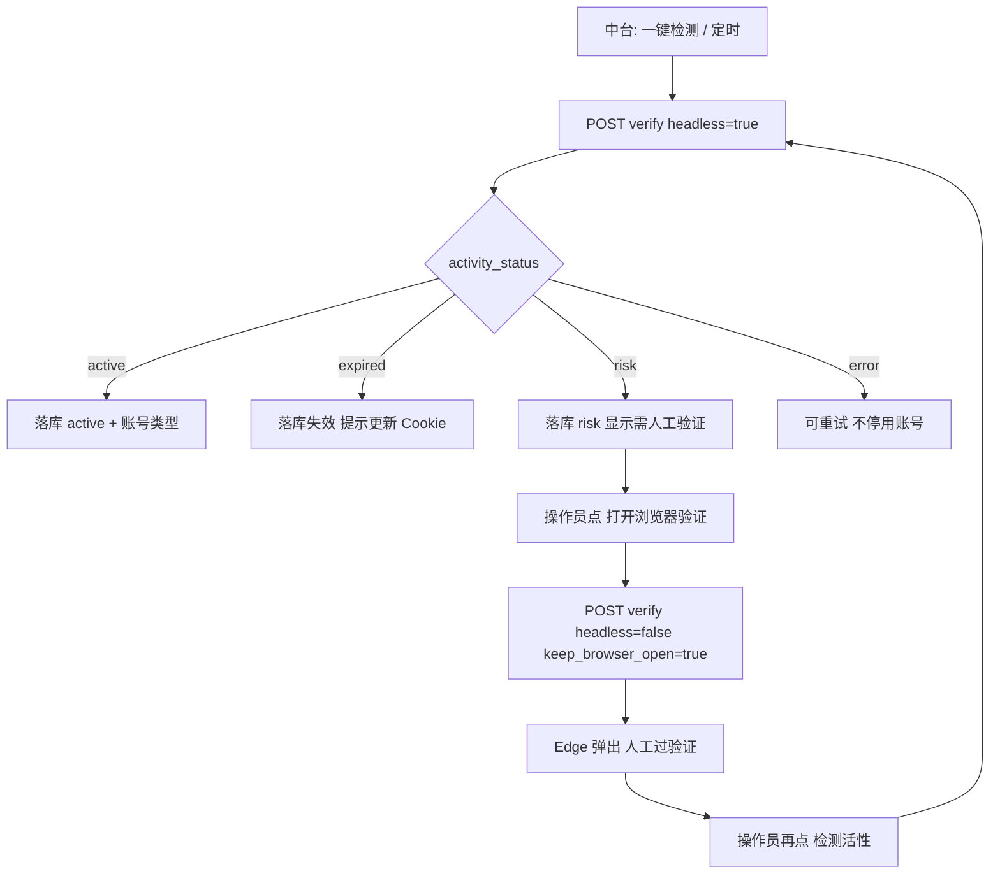

# 数据中台改造：验活无头 + 人工验证有头

本文给 **comment-kit（数据中台）** 开发使用。私信系统（aisec-agent）**已支持**有头/无头验活，无需再改 aisec 默认行为；中台需补「第二段有头人工验证」流程。

相关基础文档：`docs/数据中台对接账号验活与类型.md`

---

## 1. 为什么要两段式

| 阶段 | 模式 | 用途 |
|------|------|------|
| **第一段（日常）** | `headless: true` | 批量检测活性 + 蓝 V / 普通号，快、可定时跑 |
| **第二段（人工）** | `headless: false` + `keep_browser_open: true` | 仅当第一段返回 `risk` / 需二次验证时，弹出浏览器让人过滑块/验证码 |

无头模式下抖音常返回验证中间页，**无法自动过验证**，但应识别为 `activity_status=risk`（界面显示「需人工验证」）。此时必须走有头，不能继续无头重试。

本仓库私信回复检测已有同类做法：`private_message_executor._retry_read_after_pausing_monitor()` 在无头失败后改为 `headless=False` 重试。验活建议采用 **「按钮触发有头」**，避免批量检测时突然弹窗。

---

## 2. 流程



---

## 3. 第一段：无头检测（保持现状）

### 3.1 调用方式

中台现有逻辑不变，继续调用：

```http
POST {send_base_url}/api/v1/douyin/private-message/accounts/verify
```

```json
{
  "account_cookie": "<账号 Cookie>",
  "browser_name": "edge",
  "headless": true,
  "timeout_ms": 45000
}
```

建议 `browser_name` 用 **`edge`**（生产机 bundled chromium 无头可能启动失败，aisec 会自动回退 msedge）。

### 3.2 中台当前代码位置

| 文件 | 现状 |
|------|------|
| `services/account_verify.py` → `verify_pm_douyin_accounts()` | 写死 `'headless': True` |
| `blueprints/private_messages.py` → `api_pm_accounts_verify()` | 批量/单账号检测入口 |
| `templates/private_messages.html` → `runPrivateMessageAccountVerification()` | 前端「检测账号活性和类型」 |

**第一段不要改默认参数**，继续无头即可。

### 3.3 落库规则（已有，保持）

| 返回 | 中台处理 |
|------|----------|
| `cookie_valid=true` 且 `account_type` 为 `blue_v` / `personal` | 更新活性 + 类型 |
| `activity_status=expired` 或 `requires_login=true` | 标记失效，可停用账号 |
| `activity_status=risk` 或 `requires_verification=true` | 标记「需人工验证」，**不停用**（与 `error` 区分） |
| `activity_status=error` | 检测异常，可重试，**不因 error  alone 停用** |

`activity_status` → UI 标签映射见 `private_messages.html` → `renderPmAccountActivity()`：

- `risk` → **需人工验证**（`badge-warning`）

---

## 4. 第二段：有头人工验证（中台新增）

### 4.1 何时触发

满足任一即可展示「打开浏览器验证」按钮：

- `activity_status === 'risk'`
- `requires_verification === true`
- （可选）`activity_reason` 含「二次验证」「安全验证」「验证中间页」

**不要**对 `expired` 走有头验活（应重新抓 Cookie）；**不要**对 `active` 走有头（无必要）。

### 4.2 调用 aisec 的参数

```json
{
  "account_cookie": "<同一账号 Cookie>",
  "browser_name": "edge",
  "headless": false,
  "keep_browser_open": true,
  "persistent_context": true,
  "timeout_ms": 120000
}
```

| 字段 | 值 | 说明 |
|------|-----|------|
| `headless` | `false` | **必须**，否则操作员看不到浏览器 |
| `keep_browser_open` | `true` | 验证完成后浏览器保持打开，便于确认登录态 |
| `persistent_context` | `true` | 推荐，与盯号/回复检测有头重试一致，复用 profile |
| `browser_name` | `edge` | Windows 生产/本机均建议 edge |
| `timeout_ms` | `120000` | 人工操作需要更长超时 |

### 4.3 操作员步骤

1. 在账号列表找到「需人工验证」的账号  
2. 点击 **「打开浏览器验证」**  
3. 在弹出的 Edge 中完成滑块/验证码/二次验证  
4. 确认抖音已登录后，关闭浏览器或保留窗口  
5. 再次点击 **「检测活性」**（仍用第一段无头）→ 期望变为 `active` + `personal` / `blue_v`  

若过验证后会话 Cookie 有变化，操作员应在编辑账号里 **更新 Cookie** 后再检测（视抖音是否刷新 cookie 而定）。

---

## 5. comment-kit 改造清单

### 5.1 后端 `services/account_verify.py`

新增函数（示例签名）：

```python
def verify_pm_douyin_account_headed(account, *, provider=None):
    """Open headed browser for manual Douyin verification."""
    provider = provider or PrivateMessageProvider()
    cookie = str(account.get('account_cookie') or '').strip()
    if not cookie:
        raise ValueError('未配置 Cookie')
    return provider.verify_douyin_account({
        'account_cookie': cookie,
        'browser_name': 'edge',
        'headless': False,
        'keep_browser_open': True,
        'persistent_context': True,
        'timeout_ms': 120000,
    })
```

可选：给 `verify_pm_douyin_accounts()` 增加参数 `*, headless=True`，但**批量检测必须保持 `headless=True`**，不要批量有头。

### 5.2 后端 `blueprints/private_messages.py`

新增路由（示例）：

```python
@pm_bp.route('/api/private-messages/accounts/verify-headed', methods=['POST'])
@login_required
def api_pm_accounts_verify_headed():
    data = request.get_json(silent=True) or {}
    account_id = int(data.get('account_id') or 0)
    # 权限校验、取账号、调 verify_pm_douyin_account_headed
    # 返回 { success, message, result }；result 结构与现有 verify 一致
```

校验：

- 仅允许对当前可见账号操作  
- 建议仅当 `activity_status in ('risk', 'captcha', 'send_code')` 或 `requires_verification` 时允许（前端也限制，后端再拦一层）

**注意**：有头请求会阻塞数十秒直至浏览器启动；HTTP 超时建议 ≥ 120s（`PrivateMessageProvider` 对 verify 已 `max(timeout, 120)`）。

### 5.3 前端 `templates/private_messages.html`

#### A. 账号行操作列增加按钮

在 `verifyPrivateMessageAccount` 按钮旁，当 `activity_status === 'risk'`（等）时显示：

```html
<button type="button"
        class="pm-action-btn icon-only pm-row-action"
        onclick="openHeadedAccountVerification(${acc.id}, this)"
        title="打开浏览器完成人工验证"
        aria-label="打开浏览器完成人工验证">
  <i class="fas fa-desktop"></i>
</button>
```

仅 `risk` / `captcha` / `send_code` 时渲染，避免 active 账号误点。

#### B. 新增 JS

```javascript
async function openHeadedAccountVerification(accountId, button) {
    if (!confirm('将打开 Edge 浏览器，请在窗口内完成抖音验证。完成后请再次点击「检测活性」。')) {
        return;
    }
    setPmAccountVerifyStatus('正在打开浏览器，请在弹出的窗口中完成验证...');
    const response = await fetch('/api/private-messages/accounts/verify-headed', {
        method: 'POST',
        headers: {'Content-Type': 'application/json'},
        body: JSON.stringify({account_id: Number(accountId)}),
    });
    const data = await response.json();
    if (!response.ok || !data.success) {
        setPmAccountVerifyStatus(data.message || '打开浏览器失败', 'error');
        return;
    }
    setPmAccountVerifyStatus('浏览器已打开；完成验证后请再点「检测活性」确认结果', 'success');
    loadAccounts();
}
```

#### C. 状态文案（可选增强）

`renderPmAccountActivity()` 对 `risk` 的 `title` 可追加：`activity_reason` + 「可点击桌面图标打开浏览器验证」。

### 5.4 测试 `tests/test_account_config.py`

建议新增：

- mock `verify_douyin_account`，断言 headed 接口传 `headless=False`、`keep_browser_open=True`  
- `activity_status=risk` 时 API 允许 headed 入口  
- `activity_status=active` 时 headed 入口返回 400（若做了后端限制）

---

## 6. 运行环境要求

有头浏览器 **必须在有交互桌面的 Windows 会话** 中运行 Playwright。

| 环境 | 要求 |
|------|------|
| 本机联调 | aisec `7860` 在本机桌面会话启动（`start-local.ps1`）；中台 `send_base_url` 指向本机 LAN 地址 |
| 生产机 23 | aisec 必须以 **`ALEX001\starc` 交互用户** 运行（`/IT` 计划任务），**禁止 SYSTEM** |
| Linux 无桌面服务器 | **不能**直接有头验活；需 RDP 到 Windows 机器操作，或在本机过验证后更新 Cookie |

确认监听：

```powershell
Get-NetTCPConnection -LocalPort 7860 -State Listen
# LocalAddress 应为 0.0.0.0（局域网中台才能访问）
```

---

## 7. 与 aisec 其它能力的关系

| 能力 | 接口 | 关系 |
|------|------|------|
| 无头验活 + 类型 | `POST .../accounts/verify` | 第一段，默认 `headless=true` |
| 有头验活 | 同上，改参数 | 第二段，中台传 `headless=false` |
| 私信调试页 | aisec `admin_vue` 应用 Cookie | 可选替代方案，操作路径更长 |
| 回复检测有头重试 | `conversations/read` | 模式参考，非验活专用 |

aisec **不需要**为验活单独新增接口；统一用 `accounts/verify` 即可。

---

## 8. 验收清单

1. **批量检测**：仍无头，正常账号 → `active` + 蓝 V / 普通号  
2. **风控账号**：无头 → `risk` + 「需人工验证」，**不**误报为 `expired`  
3. **打开浏览器验证**：仅 risk 账号显示按钮；点击后本机/生产桌面弹出 Edge  
4. **人工过验证后**：再点无头检测 → `active`，普通号显示「普通号」  
5. **失效 Cookie**：无头 → `expired`，不弹出有头（应走更新 Cookie 流程）  
6. **生产环境**：7860 进程用户为 `starc`，非 SYSTEM  

---

## 9. 常见问题

**Q：为什么无头显示「需人工验证」但检测不出普通号？**  
A：第一段无头被抖音拦截，profile 接口返回未登录/验证页。应先走第二段有头过验证，再过验证后重新无头检测类型。

**Q：有头验活返回后要不要自动再检测一次？**  
A：可以中台在 headed 接口返回 `success` 后自动再调一次无头 verify；但建议默认 **让人工确认后再点检测**，避免验证未完成就写库。

**Q：浏览器谁关？**  
A：`keep_browser_open=true` 时 aisec 不会自动关；操作员完成验证后手动关窗，或中台后续增加「关闭浏览器」能力（可复用 monitor stop / account-cookie apply 的 teardown 逻辑）。

**Q：能不能批量有头？**  
A：不建议。同时弹多个浏览器易混乱，且占用桌面会话。仅单账号 `verify-headed`。

---

## 10. 改造优先级（建议）

1. `account_verify.py` + `verify-headed` API（最小闭环）  
2. 账号行「打开浏览器验证」按钮 + 确认框  
3. 单测 + 本机联调（risk 账号走通）  
4. 生产机 23 确认 starc 交互会话后再开放按钮  
